# Google Sheets ↔ Bitrix24 CRM Leads Integration Service (NestJS v12)

> Integration Service xây dựng bằng **NestJS 12 + TypeScript**, hỗ trợ đồng bộ dữ liệu khách hàng tiềm năng (Leads) 2 chiều toàn diện giữa Google Sheets và Bitrix24 CRM với chuẩn **Batch REST API (50 cmds/batch)**, Idempotency (SHA-256), Deduplication đa tiêu chí (Email & Phone), Rate Limiter (2 req/s), Exponential Backoff Jitter Retry, Real-time Webhook, Cơ chế Xác thực Linh Hoạt (Google Sheets: **Service Account / OAuth 2.0** với SQLite persistent tokens; Bitrix24: **Inbound Webhook** + Real-time Webhook) và **Giao diện Web Quản Trị (Admin Dashboard)**.

---

## 🌟 Tính Năng Cốt Lõi & Kiến Trúc (Key Features)

1. **Cơ Chế Xác Thực Đa Chiến Lược (Multi-Strategy Authentication) & Lưu Trữ Bền Vững:**
   - **Google Sheets:** Hỗ trợ linh hoạt **Google Cloud Service Account** (qua file khóa `credentials.json`) VÀ **Google OAuth 2.0** với luồng Consent Screen, tự động làm mới Access Token và lưu trữ bền vững vào SQLite (`google_tokens`).
   - **Bitrix24 CRM:** Tích hợp trực tiếp qua **Inbound Webhook** REST API chuẩn của Bitrix24 (`BITRIX_WEBHOOK_URL`), kết hợp Outbound Webhook thời gian thực (`ONCRMLEADADD`, `ONCRMLEADUPDATE`, `ONCRMLEADDELETE`).
2. **Đồng Bộ Dữ Liệu Hai Chiều & Real-time Webhook (Hybrid Two-Way Sync):**
   - **Chiều thuận (Sheet $\rightarrow$ CRM):** Quét định kỳ qua Cron hoặc kích hoạt thủ công, tự phát hiện dòng mới, cập nhật dòng thay đổi và bỏ qua dòng nguyên vẹn qua SHA-256 hash.
   - **Chiều ngược (CRM $\rightarrow$ Sheet):** Tích hợp Webhook thời gian thực (`ONCRMLEADADD`, `ONCRMLEADUPDATE`, `ONCRMLEADDELETE`) đồng bộ tức thì sang Sheet; đồng thời cung cấp nút **"Kéo dữ liệu về Sheet"** trên Admin UI để đối soát và bù đắp dữ liệu toàn diện (Reconciliation Engine).
   - **Cơ Chế Phân Trang Tự Động (Auto-Pagination):** Vượt qua giới hạn mặc định 50 bản ghi/request của Bitrix24 REST API (`listAllLeads`), tự động lặp phân trang đa trang (chunk 50 leads/trang) với giới hạn an toàn tối đa 1.000 leads kèm cơ chế Rate Limiter, đảm bảo kéo đủ 100% Leads từ CRM về Sheet mà không bị sót.
3. **Bitrix24 Batch API Engine (`/rest/batch.json`):**
   - Gom tối đa **50 lệnh CRUD** vào 1 HTTP request duy nhất, tối ưu hóa triệt để API quota (2 req/s) và hoàn tất đồng bộ 150 records qua đúng 3 batch requests.
4. **Chống Trùng Lặp Thông Minh (Deduplication) & Xử Lý Xung Đột (Conflict Resolution):**
   - Tra cứu trùng lặp đồng thời theo cả **Email** và **Số điện thoại** (`crm.duplicate.findbycomm`). Tự động liên kết Lead ID sẵn có thay vì tạo bản ghi rác.
   - Phát hiện xung đột dữ liệu chéo (`DEDUP_CONFLICT`): Cảnh báo và cô lập dòng lỗi nếu Email thuộc Lead A nhưng SĐT thuộc Lead B.
   - Tranh chấp dữ liệu hai chiều: Áp dụng chiến lược **Last-Write-Wins** dựa trên timestamp sửa đổi (`DATE_MODIFY` trên CRM vs `lastSyncTime` trên Sheet).
5. **Idempotency & Change Detection (SHA-256 Canonical Checksum):**
   - Băm SHA-256 trên cấu trúc dữ liệu chuẩn tắc (canonical sorted payload). Bỏ qua 100% các dòng không có thay đổi (`SKIPPED`), quét nhanh chỉ mất ~600ms, không tiêu tốn quota ghi của CRM.
6. **Rate Limiting & Exponential Backoff Retry (Resilience Engine):**
   - Enforce nghiêm ngặt tối đa **2 requests/giây** bằng Promise Queue (FIFO / Leaky Bucket Pattern).
   - Tự động thử lại tối đa 3 lần với **Exponential Backoff & Full Jitter** (`delay * (0.75 + 0.5 * rand)`) khi gặp lỗi mạng tạm thời (`ECONNRESET`, `ETIMEDOUT`) hoặc HTTP 429/5xx.
7. **Chuẩn Hóa Dữ Liệu & Nghiệp Vụ Linh Hoạt (Advanced Data Processing):**
   - Chuẩn hóa SĐT Việt Nam về định dạng quốc tế `+84xxxxxxxxx` (E.164), xử lý linh hoạt khoảng trắng, dấu gạch ngang, ngoặc đơn.
   - Xác thực Email chuẩn RFC 5322, chuẩn hóa ngày tháng `YYYY-MM-DD`, ánh xạ Enum Nguồn (`WEB`, `FACEBOOK`, `TRADE_SHOW`...) và Trạng thái (`NEW`, `IN_PROCESS`, `CONVERTED`...).
   - Hỗ trợ nghiệp vụ Sales thực tế: Cho phép tạo lead chỉ có SĐT (offline event) hoặc chỉ có Email (web form); tự động sinh Tiêu đề thông minh `[Tên] - [Công ty]` khi cột Tiêu đề bỏ trống.
8. **Quy Tắc Ánh Xạ Nghiêm Ngặt (Strict Schema Mapping - No Guesswork):**
   - Chỉ đồng bộ và cập nhật các cột đã được định nghĩa tường minh trong `mapping.json`, ngăn chặn việc sửa cột chưa map trên Sheet gây sai lệch dữ liệu trên CRM.
9. **Cô Lập Lỗi Từng Dòng & Khôi Phục Zombie Record:**
   - Lỗi dữ liệu trên 1 dòng (sai enum, sai số, thiếu thông tin liên hệ) được cô lập tại dòng đó, ghi rõ nguyên nhân bằng tiếng Việt vào cột `Thông báo lỗi`, tuyệt đối **không làm gián đoạn các dòng hợp lệ còn lại trong batch**.
   - Phát hiện Lead đã bị xóa trên CRM (Zombie Record), thông báo rõ trên Sheet kèm hướng dẫn xóa Lead ID để tạo mới lại.
10. **Web Admin Dashboard (`/admin`):**
    - Giao diện Glassmorphism dark-mode thân thiện cho người dùng Non-Tech: theo dõi số liệu trực quan, kích hoạt sync 1 chạm (thuận & ngược), quản lý cấu hình ánh xạ cột linh hoạt từ danh mục trường Bitrix24 thực tế.

---

## 🏛️ Kiến Trúc Hệ Thống (Clean Architecture & SOLID)

Hệ thống được tổ chức phân lớp rõ ràng theo nguyên tắc **Clean Architecture** và **SOLID**:

```
src/
├── admin/                                  # [Presentation / MVC] Admin Dashboard Controller, Auth Controller & Views
├── bitrix/
│   ├── interfaces/                         # [Domain Contracts] Interface trừu tượng hóa xác thực Bitrix24
│   ├── services/
│   │   ├── bitrix-lead.service.ts          # [Infrastructure] CRUD Lead, Batch API (50 cmds), Duplicate Finder
│   │   ├── bitrix.service.ts               # [Infrastructure] Client HTTP tầng thấp
│   │   ├── bitrix-rate-limiter.service.ts  # [Infrastructure] Quản lý lưu lượng 2 req/s (Queue pattern)
│   │   └── retry.service.ts                # [Infrastructure] Exponential Backoff với Full Jitter
│   └── strategies/                         # [Auth Strategy] BitrixWebhookStrategy
├── common/                                 # [Cross-Cutting] Constants tiếng Việt, Logger Pino, Date Helper
├── config/                                 # [Infrastructure] Typed Configuration & Joi Validation Schema
├── databases/                              # [Infrastructure] TypeORM SQLite Database Module
├── google-sheets/
│   ├── entities/                           # [Auth Entity] GoogleTokenEntity (SQLite table)
│   ├── interfaces/                         # [Domain Contracts] Interface SheetRow & Auth
│   ├── strategies/                         # [Auth Strategy] ServiceAccountStrategy & GoogleOAuthStrategy
│   ├── utils/                              # [Utils] Chuyển đổi chỉ số cột 0-index sang A1 notation
│   └── google-sheets.service.ts            # [Infrastructure] Đọc/Ghi Batch, ẩn cột hệ thống qua Sheets API v4
├── health/                                 # [Infrastructure] Healthcheck Endpoint (/api/health)
├── mapping/
│   ├── normalizers/                        # [Domain] Chuẩn hóa Phone E.164, Email RFC
│   └── services/mapping.service.ts         # [Domain Service] Biến đổi hai chiều Sheet ↔ Bitrix theo mapping.json
└── sync/
    ├── commands/                           # [CLI] Nest Commander CLI Entry (npm run sync)
    ├── controllers/                        # [Presentation] REST SyncController & WebhookController
    ├── entities/                           # [Domain Entity] SyncHistoryEntity (SQLite table)
    ├── interfaces/                         # [Domain Contracts] Interface kết quả và pipeline đồng bộ
    ├── schedulers/                         # [Infrastructure] Dynamic Cron Job Scheduler
    └── services/
        ├── sync-orchestrator.service.ts    # [Application / Facade] Điều phối toàn bộ pipeline đồng bộ
        ├── forward-sync.service.ts         # [Domain UseCase] Xử lý đồng bộ chiều thuận (Sheet -> CRM)
        ├── reverse-sync.service.ts         # [Domain UseCase] Xử lý đồng bộ chiều ngược (CRM -> Sheet)
        ├── deduplication.service.ts        # [Domain Service] Chống trùng lặp Email/SĐT & xử lý xung đột
        ├── hash.service.ts                 # [Domain Service] Băm SHA-256 kiểm tra Idempotency
        ├── lock.service.ts                 # [Infrastructure] In-memory Mutex Lock chống Race Condition
        └── sync-history.service.ts         # [Application] Lưu trữ lịch sử thực thi vào SQLite & Memory Cache
scripts/
├── system_test.cjs                         # Bộ kiểm thử hệ thống trực tiếp toàn diện 22 Test Cases (100% Pass)
├── live_benchmark.cjs                      # Benchmark hiệu năng thực tế với 150 records thật (có prompt xóa/giữ data)
└── cleanup_benchmark.cjs                   # Tiện ích dọn dẹp dữ liệu benchmark trên Google Sheet và Bitrix24
```

---

## 🛠️ Công Nghệ Sử Dụng (Tech Stack) & Yêu Cầu Môi Trường

| Thành Phần         | Công Nghệ / Thư Viện        |       Phiên Bản       | Ghi Chú                                                                                                                             |
| :----------------- | :-------------------------- | :-------------------: | :---------------------------------------------------------------------------------------------------------------------------------- |
| **Runtime**        | **Node.js**                 | **v20.19+ / v22.12+** | Hỗ trợ đầy đủ ESM và native asynchronous features.                                                                                  |
| **Framework**      | **NestJS Core**             |      **v12.0.1**      | Kiến trúc Clean Architecture, Dependency Injection.                                                                                 |
| **Language**       | **TypeScript**              |      **v6.0.3**       | Strict type-safety, Decorator metadata.                                                                                             |
| **Database & ORM** | **SQLite3 + TypeORM**       | **v5.1.7 / v0.3.31**  | Lưu trữ token OAuth và lịch sử đồng bộ bền vững.                                                                                    |
| **Google Client**  | **googleapis**              |     **v178.0.0**      | Google Sheets API v4 (Service Account & OAuth 2.0).                                                                                 |
| **HTTP & Batch**   | **Axios + @nestjs/axios**   | **v1.20.0 / v12.0.0** | Giao tiếp REST API & Batch JSON 50 cmds/req.                                                                                        |
| **Scheduling**     | **@nestjs/schedule + cron** |      **v12.0.1**      | Cron job tự động chạy ngầm theo chu kỳ cấu hình.                                                                                    |
| **CLI Command**    | **nest-commander**          |      **v3.21.0**      | Lệnh CLI thủ công `npm run sync` (hỗ trợ cờ `-f, --force`).                                                                         |
| **Validation**     | **Joi**                     |      **v18.2.8**      | Validate biến môi trường `.env` nghiêm ngặt khi khởi động.                                                                          |
| **Logging**        | **Pino (nestjs-pino)**      |      **v5.1.0**       | Structured JSON log + Bảng Unicode tóm tắt tiếng Việt.                                                                              |
| **Linter & Test**  | **oxlint + Vitest**         | **v1.82.0 / v4.1.11** | 25 test suites / 201 unit tests (100%), 0 lint error trên 79 files. Độ phủ Lines 96.35%, Stmts 95.83%, Branch 82.65%, Funcs 97.88%. |

---

## 🚀 Hướng Dẫn Cài Đặt & Khởi Chạy Nhanh

### 1. Cài đặt dependencies

```bash
npm install
# Hoặc trên các phiên bản npm cũ nếu gặp kiểm tra strict peer dependency:
npm install --legacy-peer-deps
```

> [!NOTE]
> File `package.json` đã được cấu hình sẵn khối `overrides` tương thích hoàn hảo giữa NestJS v12, TypeScript v6 và các thư viện CLI phụ trợ, do đó lệnh `npm install` thông thường sẽ hoàn tất nhanh chóng và sạch sẽ 100%.

### 2. Cấu hình file `.env`

Tạo file `.env` từ `.env.example`:

```env
# Application Configuration
NODE_ENV=development
PORT=3000
LOG_LEVEL=info
DATABASE_PATH=data/database.sqlite

# ========================================================
# Bitrix24 Configuration (Inbound Webhook)
# ========================================================
BITRIX_WEBHOOK_URL=https://your-domain.bitrix24.vn/rest/1/webhook_token/
BITRIX_RATE_LIMIT_RPS=2
BITRIX_MAX_RETRIES=3

# Token ứng dụng Outbound Webhook từ Bitrix24 gửi sang server
BITRIX_INBOUND_WEBHOOK_SECRET=your_bitrix_webhook_auth_token

# ========================================================
# Google Sheets Configuration
# ========================================================
# Auth Type: SERVICE_ACCOUNT (mặc định) hoặc OAUTH2
GOOGLE_AUTH_TYPE=SERVICE_ACCOUNT

# Cấu hình Service Account Google (Active khi GOOGLE_AUTH_TYPE=SERVICE_ACCOUNT)
GOOGLE_SHEET_ID=your_google_sheet_id_here
GOOGLE_SHEET_NAME=Leads
GOOGLE_SHEETS_CREDENTIALS_PATH=./config/credentials.json
GOOGLE_SERVICE_ACCOUNT_EMAIL=sync-service@project.iam.gserviceaccount.com

# Cấu hình OAuth 2.0 Google (Active khi GOOGLE_AUTH_TYPE=OAUTH2)
GOOGLE_OAUTH_CLIENT_ID=
GOOGLE_OAUTH_CLIENT_SECRET=
GOOGLE_OAUTH_REDIRECT_URI=http://localhost:3000/api/auth/google/callback

# ========================================================
# Synchronization Engine Configuration
# ========================================================
SYNC_DIRECTION=TWO_WAY
SYNC_CRON=*/15 * * * *
SYNC_BATCH_SIZE=50
SYNC_MAPPING_PATH=./config/mapping.json
SYNC_MUTEX_TIMEOUT_MS=300000
```

### 3. Khởi chạy ứng dụng

```bash
# Chế độ phát triển (Development watch mode):
npm run start:dev

# Chạy bản Production:
npm run build
npm run start:prod

# Chạy với Docker & Docker Compose:
docker compose up -d --build
```

- **Truy cập Giao diện Quản Trị (Admin Dashboard):** 👉 `http://localhost:3000/admin`

---

## 💻 Các Lệnh Thao Tác, Kiểm Thử & Benchmark

| Mục Đích                            | Câu Lệnh                         | Mô Tả Chi Tiết                                                                                                                |
| :---------------------------------- | :------------------------------- | :---------------------------------------------------------------------------------------------------------------------------- |
| **Đồng bộ thủ công CLI**            | `npm run sync`                   | Chạy đồng bộ trực tiếp từ dòng lệnh (dùng cơ chế hash check).                                                                 |
| **Ép buộc đồng bộ CLI**             | `npm run sync -- -f`             | Bỏ qua hash check, ép buộc đồng bộ lại toàn bộ các dòng.                                                                      |
| **System Test (Kiểm thử hệ thống)** | `npm run test:system`            | Chạy toàn bộ **22 Test Cases / 103 Assertions** kiểm thử trực tiếp trên Sheet & CRM thực tế (`node scripts/system_test.cjs`). |
| **Live Benchmark (150 records)**    | `npm run benchmark`              | Chạy kiểm thử hiệu năng với **150 records thật** vào Sheet và Bitrix24 (kèm prompt hỏi xóa/giữ data).                         |
| **Benchmark giữ data**              | `npm run benchmark -- --keep`    | Chạy benchmark và giữ nguyên 150 records để đối soát trên UI Sheet/CRM.                                                       |
| **Benchmark tự dọn dẹp**            | `npm run benchmark -- --cleanup` | Chạy benchmark và tự động dọn dẹp sạch sẽ sau khi hoàn tất.                                                                   |
| **Dọn dẹp Benchmark độc lập**       | `npm run benchmark:cleanup`      | Tiện ích xóa toàn bộ 150 leads benchmark trên CRM và 150 dòng test trên Sheet.                                                |
| **Unit Tests**                      | `npm test`                       | Chạy toàn bộ **25 Test Suites / 201 Unit Tests** bằng Vitest (100% Pass).                                                     |
| **Test Coverage**                   | `npm run test:cov`               | Báo cáo độ phủ mã nguồn (Lines: 96.35%, Stmts: 95.83%, Branch: 82.65%, Funcs: 97.88% - tất cả các file đều $\ge 70\%$).       |
| **E2E Tests**                       | `npm run test:e2e`               | Chạy 8 kịch bản kiểm thử tích hợp End-to-End API (100% Pass).                                                                 |
| **Linter**                          | `npm run lint`                   | Kiểm tra chất lượng mã nguồn bằng `oxlint` (0 warning, 0 error trên 79 files).                                                |

---

## 🌐 Hướng Dẫn Cấu Hình Tích Hợp Chi Tiết

### 1. Cấu hình Google Cloud Service Account & Google Sheet

1. **Tìm kiếm Google Sheets API:**
   - Truy cập [Google Cloud Console](https://console.cloud.google.com/), nhập `google sheet api` vào thanh tìm kiếm phía trên và chọn **Google Sheets API**.

   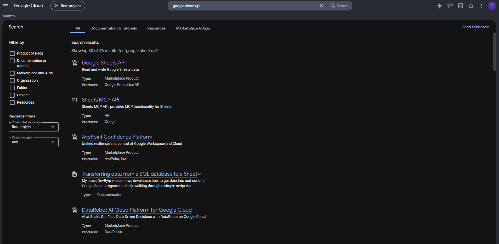

2. **Kích hoạt Google Sheets API:**
   - Tại trang chi tiết API, bấm **Enable** để kích hoạt Google Sheets API cho dự án.

   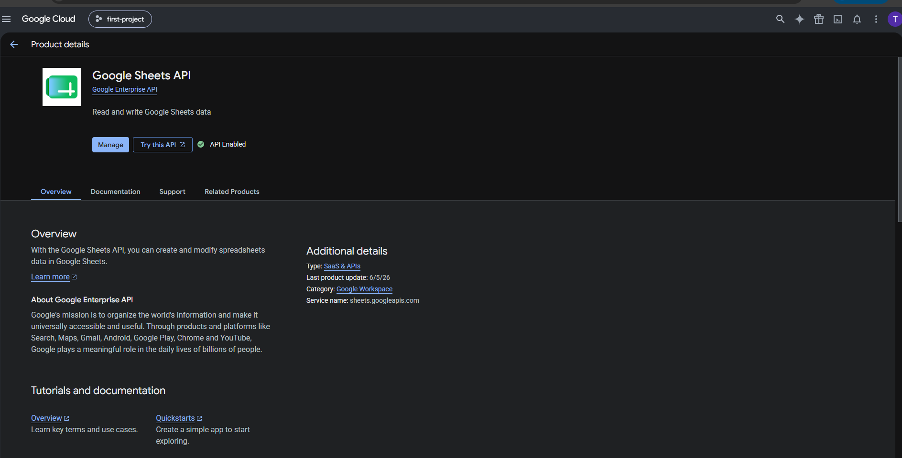

3. **Truy cập mục Service Accounts:**
   - Điều hướng menu bên trái vào **IAM & Admin** $\rightarrow$ **Service Accounts**, sau đó bấm **+ Create service account**.

   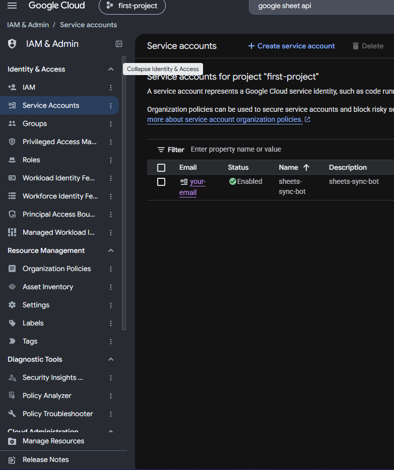

4. **Tạo Service Account:**
   - Điền thông tin tài khoản (ví dụ: `sheets-sync-bot`) $\rightarrow$ Bấm **Create and continue** $\rightarrow$ Bấm **Done**.

   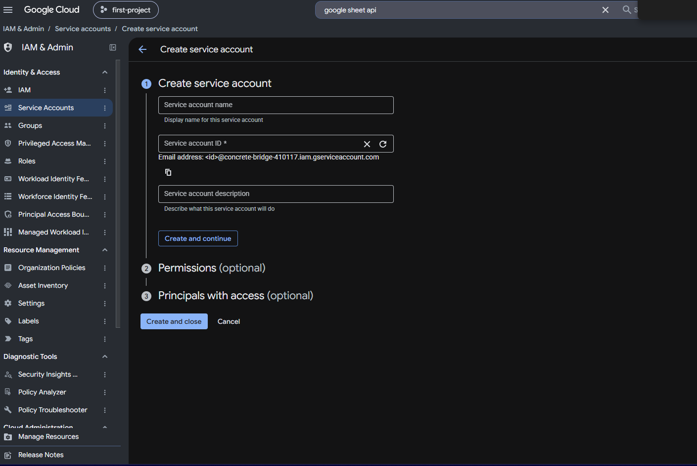

5. **Tạo và tải Khóa JSON (Credentials):**
   - Nhấp vào Service Account vừa tạo $\rightarrow$ Chuyển sang tab **Keys** $\rightarrow$ Bấm **Add key** $\rightarrow$ **Create new key** $\rightarrow$ Chọn định dạng **JSON** $\rightarrow$ Bấm **Create**.
   - Lưu file tải về vào đường dẫn `config/credentials.json` của dự án.

   

6. **Phân quyền và lấy Google Sheet ID:**
   - Mở Google Sheet cần đồng bộ (sheet name: `Leads`), bấm **Chia sẻ (Share)** ở góc trên bên phải.
   - Thêm email của Service Account (dạng `xxx@project.iam.gserviceaccount.com`) với vai trò **Người chỉnh sửa (Editor)** $\rightarrow$ Bấm **Xong**.
   - Sao chép Sheet ID từ URL trình duyệt: `https://docs.google.com/spreadsheets/d/{GOOGLE_SHEET_ID}/edit` và điền vào `GOOGLE_SHEET_ID` trong file `.env`.

   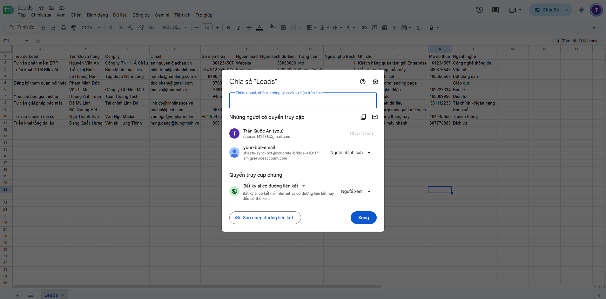

---

### 2. Cấu hình Google OAuth 2.0 (Dành cho chế độ GOOGLE_AUTH_TYPE=OAUTH2)

Nếu bạn muốn ủy quyền trực tiếp bằng tài khoản cá nhân, hãy thực hiện các bước sau trên **Google Cloud Console** (giao diện Google Auth Platform):

1. **Cấu hình Quyền truy cập Google Sheets (Data Access / Scopes):**
   - Điều hướng menu bên trái vào mục **Data Access** $\rightarrow$ Bấm nút **Add or remove scopes**.
   - Tìm kiếm và tích chọn phạm vi: `https://www.googleapis.com/auth/spreadsheets` (Quyền xem, chỉnh sửa bảng tính Google Sheets) $\rightarrow$ Bấm **Update / Save**.

   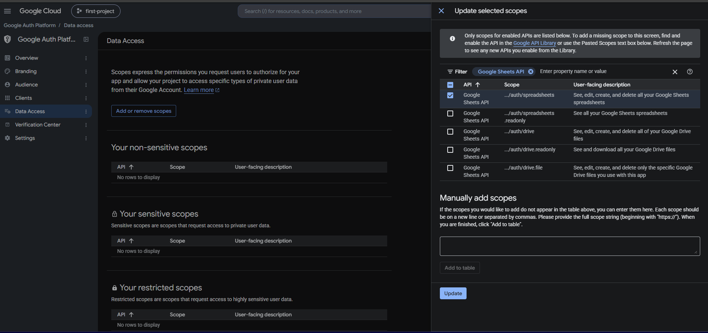

2. **Quản lý Đối tượng & Người dùng thử nghiệm (Audience & Test users):**
   - Ở menu bên trái, chọn mục **Audience** để vào phần quản trị người dùng ứng dụng.
   - Cuộn xuống phần **Test users** (Người dùng thử nghiệm).

   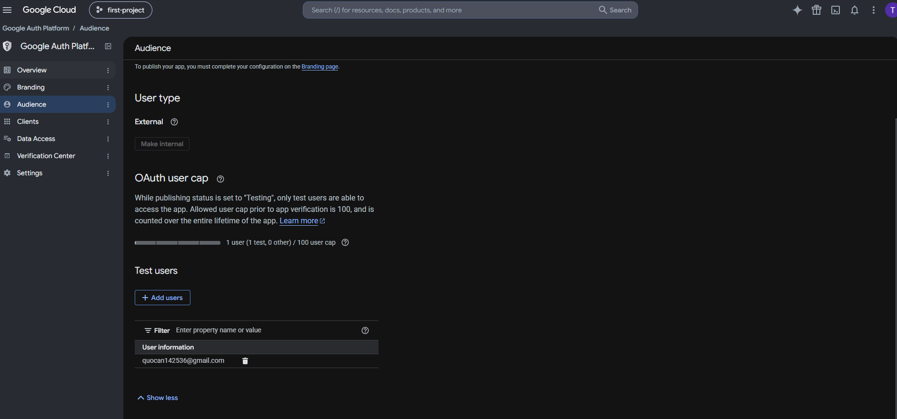

3. **Thêm tài khoản Gmail kiểm thử (Add Test User):**
   - Bấm nút **+ Add users**.
   - Nhập địa chỉ Gmail của bạn (chính là tài khoản bạn dùng để truy cập và chỉnh sửa bảng tính Google Sheets) $\rightarrow$ Bấm **Save**.

   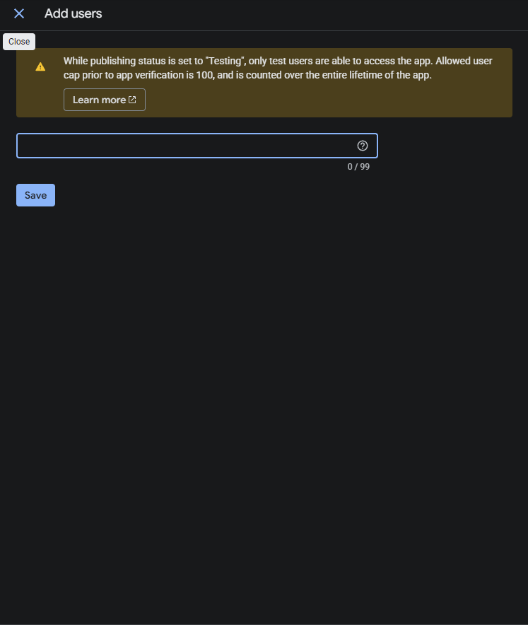

4. **Quản lý danh sách OAuth Clients:**
   - Điều hướng menu bên trái vào mục **Clients** để xem và quản lý các thông tin xác thực OAuth.

   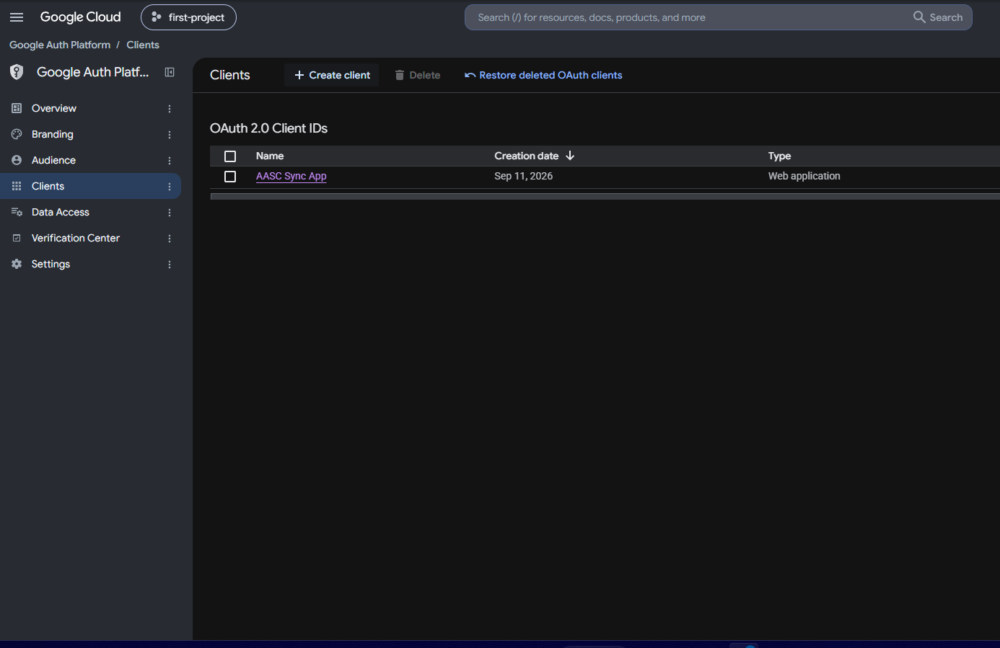

5. **Tạo OAuth Client ID & Secret:**
   - Bấm nút **+ Create Client** $\rightarrow$ Thiết lập:
     - **Application type:** Chọn **Web application**.
     - **Name:** Đặt tên (ví dụ: `AASC Sync App`).
     - **Authorized redirect URIs (Quan trọng nhất):** Bấm **+ Add URI** và điền chính xác:
       ```
       http://localhost:3000/api/auth/google/callback
       ```
     - Bấm **Create** $\rightarrow$ Sao chép **Client ID** và **Client secret** dán vào file `.env`.

   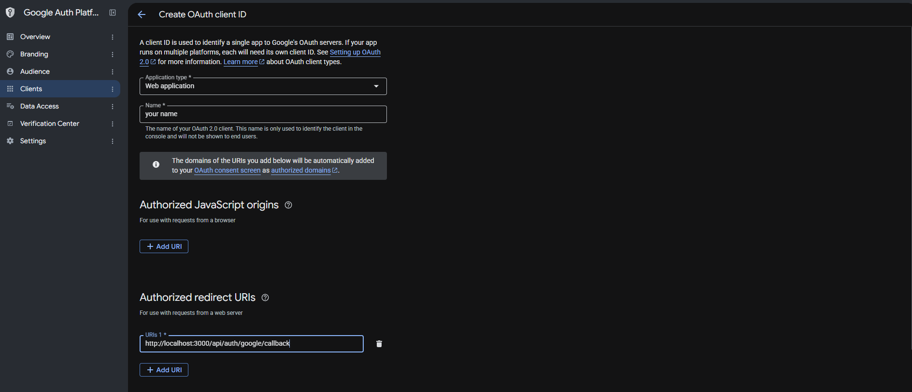

6. **Xác thực 1 Chạm trên Admin Dashboard:**
   - Sau khi cấu hình xong trong `.env`:
     ```env
     GOOGLE_AUTH_TYPE=OAUTH2
     GOOGLE_OAUTH_CLIENT_ID=xxxxxxxx.apps.googleusercontent.com
     GOOGLE_OAUTH_CLIENT_SECRET=GOCSPX-xxxxxxxx
     GOOGLE_OAUTH_REDIRECT_URI=http://localhost:3000/api/auth/google/callback
     ```
   - Truy cập trang Quản Trị: [http://localhost:3000/admin](http://localhost:3000/admin).
   - Nút **`[G] Kết nối Google với OAUTH2`** sẽ xuất hiện trên thanh Header. Bấm vào nút này để mở màn hình đăng nhập Google và cấp quyền.
   - Sau khi bấm "Cho phép", hệ thống sẽ **tự động chuyển hướng quay trở lại trang Admin** với thông báo Toast xanh:
     > _"🎉 Kết nối Google Sheets thành công! Hệ thống đã sẵn sàng đồng bộ."_
   - Huy hiệu kết nối sẽ lập tức chuyển sang: `✓ Google Sheets: Đã kết nối`.

---

### 3. Cấu hình Webhook trên Bitrix24 CRM

1. **Truy cập trang cấu hình Webhook:**
   - Đăng nhập portal Bitrix24 $\rightarrow$ Menu bên trái chọn **Tài nguyên cho nhà phát triển (Developer resources)** $\rightarrow$ **Khác (Other)**.

   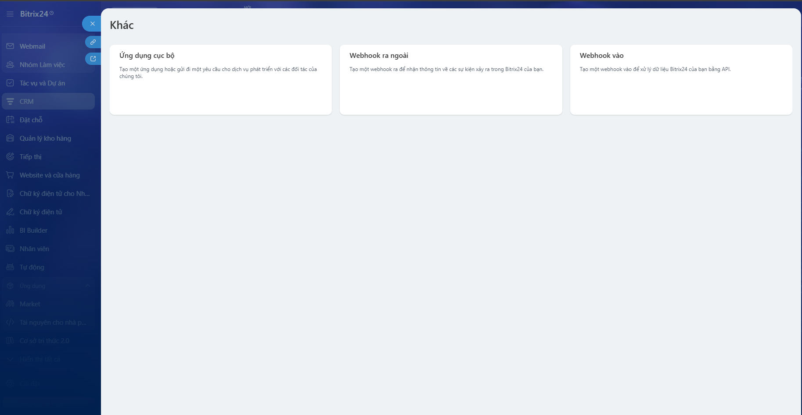

2. **Cấu hình Inbound Webhook (Bắt buộc - Đồng bộ từ Sheet sang CRM):**
   - Chọn thẻ **Webhook vào (Inbound webhook)**.
   - Tại mục **Các quyền truy cập**: Chọn quyền **CRM (`crm`)**.
   - Bấm nút **Create (Tạo)** $\rightarrow$ Sao chép đường dẫn **Webhook để gọi REST API** (dạng `https://your-domain.bitrix24.vn/rest/1/token/`) và dán vào biến `BITRIX_WEBHOOK_URL` trong file `.env`.

   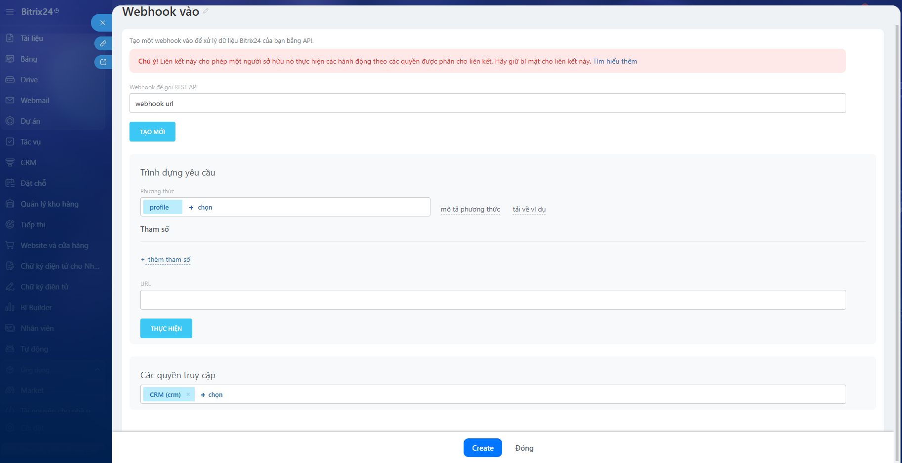

3. **Thiết lập Ngrok Tunnel (Bắt buộc để nhận Webhook thời gian thực từ Bitrix24 về Localhost):**

   - **Bước 3.1: Cài đặt Ngrok (Chọn 1 trong các cách sau):**
     - Cách 1: Qua Windows Package Manager (Khuyên dùng):
       ```bash
       winget install ngrok.ngrok
       ```
     - Cách 2: Qua Chocolatey:
       ```bash
       choco install ngrok
       ```
     - Cách 3: Qua npm (toàn cục):
       ```bash
       npm install -g ngrok
       ```
     - Cách 4: Tải trực tiếp file `.exe` từ trang chủ [ngrok.com/download](https://ngrok.com/download), giải nén và đưa vào biến môi trường `PATH`.

   - **Bước 3.2: Đăng ký & Gắn Authtoken (Miễn phí 100%):**
     1. Truy cập [dashboard.ngrok.com/signup](https://dashboard.ngrok.com/signup) để đăng ký một tài khoản miễn phí.
     2. Lấy chuỗi **Authtoken** tại mục _Your Authtoken_.
     3. Mở terminal và chạy lệnh kích hoạt:
        ```bash
        ngrok config add-authtoken <YOUR_NGROK_AUTHTOKEN>
        ```

   - **Bước 3.3: Khởi chạy Ngrok Tunnel:**
     Chạy lệnh sau trên một cửa sổ Terminal riêng biệt:
     ```bash
     ngrok http 3000
     ```
     Màn hình sẽ hiển thị thông tin đường hầm Forwarding:
     ```text
     Forwarding   https://abc1-23-45-67-89.ngrok-free.app -> http://localhost:3000
     ```
     > Sao chép đường dẫn HTTPS này (ví dụ: `https://abc1-23-45-67-89.ngrok-free.app`).

4. **Cấu hình Outbound Webhook trên Bitrix24 (Real-time từ Bitrix24 về Sheet):**
   - Trên portal Bitrix24, chọn thẻ **Webhook ra ngoài (Outbound webhook)**:
     - **URL xử lý của bạn\***: Điền endpoint webhook kèm domain ngrok vừa lấy ở trên:
       ```
       https://<your-subdomain>.ngrok-free.app/api/webhook/bitrix
       ```
     - **Token ứng dụng**: Sao chép chuỗi token hiển thị trên màn hình và điền vào biến `BITRIX_INBOUND_WEBHOOK_SECRET` trong file `.env`.
     - **Các sự kiện**: Tích chọn 3 sự kiện CRM:
       - `Tạo lead mới (ONCRMLEADADD)`
       - `Cập nhật lead (ONCRMLEADUPDATE)`
       - `Xóa lead (ONCRMLEADDELETE)`
     - Bấm nút **Save (Lưu)** để hoàn tất.

   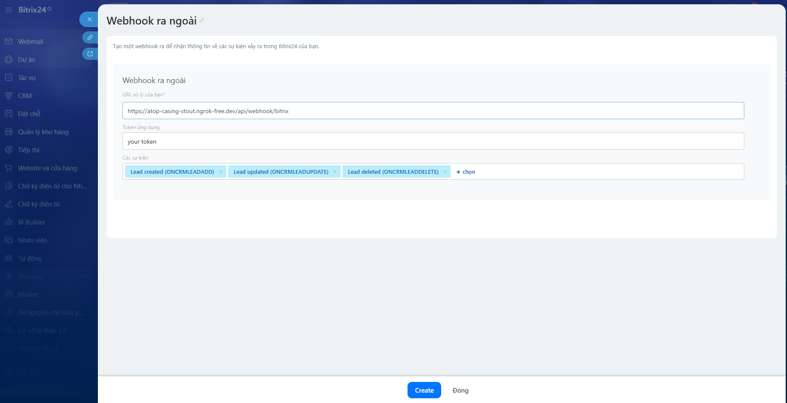

   > [!TIP]
   > Nếu bạn sử dụng tài khoản Ngrok miễn phí, mỗi lần khởi động lại lệnh `ngrok http 3000`, URL forwarding có thể thay đổi. Hãy cập nhật lại **URL xử lý của bạn** trên Bitrix24 hoặc đăng ký 1 Static Domain miễn phí trên Ngrok Dashboard để URL luôn cố định.

---

## 📡 Danh Sách API Endpoints

| Method | Endpoint                    | Mô Tả Chức Năng                                                                                              |
| :----- | :-------------------------- | :----------------------------------------------------------------------------------------------------------- |
| `POST` | `/api/sync/trigger`         | Kích hoạt đồng bộ thủ công từ Google Sheets sang Bitrix24 (`{ "force": true }` để ép buộc đồng bộ lại).      |
| `POST` | `/api/sync/two-way`         | Kích hoạt đồng bộ ngược toàn diện từ Bitrix24 về Google Sheets (Reconciliation Engine).                      |
| `POST` | `/api/sync/reverse`         | Kích hoạt đồng bộ ngược từ Bitrix24 về Google Sheets (hỗ trợ query `?leadId=123`).                           |
| `GET`  | `/api/sync/status`          | Xem trạng thái mutex lock, số lượng dòng trên sheet và kết quả lần chạy gần nhất.                            |
| `GET`  | `/api/sync/logs`            | Lấy lịch sử 20 lần đồng bộ gần nhất từ SQLite phục vụ Admin Dashboard.                                       |
| `POST` | `/api/webhook/bitrix`       | Tiếp nhận sự kiện Webhook thời gian thực từ Bitrix24 (`ONCRMLEADADD`, `ONCRMLEADUPDATE`, `ONCRMLEADDELETE`). |
| `GET`  | `/api/mapping`              | Lấy danh sách quy tắc ánh xạ cột hiện tại từ file `config/mapping.json`.                                     |
| `POST` | `/api/mapping`              | Cập nhật quy tắc ánh xạ cột mới và ghi bền vững xuống đĩa.                                                   |
| `GET`  | `/api/bitrix/lead-fields`   | Lấy danh mục trường thực tế của Lead từ Bitrix24 phục vụ Admin dropdown selector.                            |
| `GET`  | `/api/auth/google/status`   | Kiểm tra chế độ xác thực và trạng thái sẵn sàng của Google Sheets (OAuth 2.0 vs Service Account).            |
| `GET`  | `/api/auth/google/url`      | Lấy URL ủy quyền Google OAuth 2.0 (Consent Screen) với tham số chọn tài khoản.                               |
| `GET`  | `/api/auth/google/callback` | Callback tiếp nhận Authorization Code, tự động lưu token SQLite và redirect về `/admin?auth=success`.        |
| `GET`  | `/api/health`               | Kiểm tra tình trạng hoạt động (Healthcheck) của dịch vụ.                                                     |
| `GET`  | `/admin`                    | Giao diện Web Quản Trị trực quan (Admin Dashboard - truy cập `/` tự động chuyển hướng sang `/admin`).        |

---

## 🛡️ Xử Lý Lỗi, Quota & Tối Ưu Hiệu Năng

| Tình Huống / Thử Thách Kỹ Thuật                          | Cơ Chế Xử Lý & Giải Pháp Kiến Trúc                                                                                                                                                                                                 | Cách Kiểm Tra / Test Case                                                                                                     |
| :------------------------------------------------------- | :--------------------------------------------------------------------------------------------------------------------------------------------------------------------------------------------------------------------------------- | :---------------------------------------------------------------------------------------------------------------------------- |
| **Bảo toàn Quota API & Idempotency**                     | Băm dữ liệu chuẩn hóa bằng **SHA-256**. Nếu hash trùng khớp với cột `Sync Hash` $\rightarrow$ Bỏ qua (`SKIPPED`). Giảm **quota API** khi dữ liệu tĩnh.                                                                             | `TC2` trong `system_test.cjs`: Sync lần 2 khi chưa sửa sheet $\rightarrow$ Nhận `skipped >= 10`.                              |
| **Gom Cụm Batch CRUD (50 cmds/req)**                     | Sử dụng Bitrix24 `/rest/batch.json`. Gom 50 thao tác tạo/sửa vào 1 request. Phía Google Sheets dùng `batchUpdate` ghi toàn bộ cell và metadata trong 1 lần gọi.                                                                    | `npm run benchmark`: Đồng bộ 150 records thật qua đúng 3 batch requests.                                                      |
| **Chống Trùng Lặp Kép (Email & Phone)**                  | Tra cứu `crm.duplicate.findbycomm` theo cả Email và Phone chuẩn hóa E.164. Tự động liên kết Lead ID sẵn có thay vì tạo bản ghi rác.                                                                                                | `TC4`, `TC15`: Thêm dòng trùng Email hoặc trùng SĐT $\rightarrow$ Tự map Lead ID cũ và cập nhật thông tin.                    |
| **Xung Đột Dữ Liệu Chéo (`DEDUP_CONFLICT`)**             | Phát hiện trường hợp dị biệt: Email thuộc Lead A nhưng Phone thuộc Lead B. Đánh dấu `LỖI`, cô lập dòng và không tạo/ghi đè sai dữ liệu.                                                                                            | `TC16`: Thêm dòng có Email của Lead 1 + SĐT của Lead 2 $\rightarrow$ Báo lỗi `DEDUP_CONFLICT` trên Sheet.                     |
| **Chuẩn Hóa Số Điện Thoại Đa Định Dạng**                 | Xóa sạch ký tự định dạng (khoảng trắng, dấu gạch ngang, ngoặc đơn), chuẩn hóa đầu số nội địa `0` hoặc `84` thành định dạng quốc tế `+84`.                                                                                          | `TC17`: Nhập SĐT `"0935 112 233"` $\rightarrow$ Bitrix24 lưu trữ chuẩn xác `+84935112233`.                                    |
| **Nhu Cầu Nhập Liệu Thực Tế Cho Sales**                  | Không ép buộc phải có cả Email lẫn Phone (chỉ cần tối thiểu 1 trong 2). Không ép cột Tiêu đề (tự sinh từ `[Tên] - [Công ty]`).                                                                                                     | `TC18`, `TC19`: Tạo Lead chỉ có SĐT (offline event) hoặc chỉ có Email (web form) thành công 100%.                             |
| **Quản Lý Lưu Lượng (Rate Limiting)**                    | Giới hạn nghiêm ngặt **2 requests/giây** bằng Promise Queue (FIFO Queue). Đảm bảo tuân thủ 100% chính sách API của Bitrix24.                                                                                                       | Chạy benchmark 150 records $\rightarrow$ Queue tự giãn cách nhịp nhàng, **0 lỗi HTTP 429**.                                   |
| **Khả Năng Phục Hồi (Retry & Jitter)**                   | Bắt các lỗi tạm thời (`429`, `5xx`, ngắt mạng). Tự động retry tối đa 3 lần với **Exponential Backoff & Full Jitter** (`delay * (0.75 + 0.5 * rand)`).                                                                              | `TC1`: Kiểm thử khả năng chịu lỗi và tự hồi phục khi mạng biến động.                                                          |
| **Cô Lập Lỗi Từng Dòng (Fail-Safe Batch)**               | Batch API trả về `result_error` cho từng key. Hệ thống bắt lỗi cục bộ cho dòng đó (`failed++`), ghi rõ lý do vào Sheet và **hoàn tất các dòng còn lại**.                                                                           | `TC5`, `TC22`: Thêm dòng sai enum hoặc sai số $\rightarrow$ Báo Lỗi rõ ràng trên Sheet, các dòng khác bình thường.            |
| **Xử Lý Lead Bị Xóa Trên CRM (Zombie Prevention)**       | Khi Lead bị xóa trên Bitrix24, hệ thống phát hiện và ghi rõ: `"LỖI: Lead #ID đã bị xóa trên CRM (Xóa Lead ID trên Sheet nếu muốn tạo mới)"`.                                                                                       | `TC6`: Xóa lead trên Bitrix $\rightarrow$ Dòng trên Sheet báo lỗi rõ ràng kèm hướng dẫn khắc phục.                            |
| **Bảo Mật Webhook (Token Authentication)**               | Xác thực `application_token` từ Bitrix24 gửi sang `POST /api/webhook/bitrix`. Từ chối ngay lập tức (HTTP 401) nếu token không khớp secret.                                                                                         | `TC12`: Gửi webhook kèm token giả mạo `invalid_token_123` $\rightarrow$ Request bị từ chối 401.                               |
| **Xử Lý Tranh Chấp (Last-Write-Wins)**                   | So sánh `DATE_MODIFY` của Bitrix24 với `lastSyncTime` trên Sheet. Bản ghi nào sửa đổi sau sẽ có quyền ghi đè, bảo toàn tính nhất quán.                                                                                             | `TC13`: Sửa đổi dữ liệu trên Bitrix với timestamp mới $\rightarrow$ Sheet tự cập nhật theo Bitrix.                            |
| **Chống Vòng Lặp Webhook (Anti-Echo Loop)**              | Khi chiều thuận vừa cập nhật Lead lên Bitrix, Bitrix sẽ bắn webhook dội lại. Hệ thống cache ID trong 30s để bỏ qua webhook dội này.                                                                                                | `TC9`: Webhook kích hoạt đồng bộ mà không rơi vào vòng lặp vô tận (Ping-Pong Loop).                                           |
| **Chống Race Condition (Mutex Lock)**                    | `LockService` dạng in-memory mutex với TTL tự giải phóng (5 phút). Chặn triệt để xung đột khi Webhook, Cron và Admin cùng bấm sync.                                                                                                | Gọi đồng thời 2 trigger sync $\rightarrow$ Request thứ hai nhận cảnh báo đang có tiến trình chạy.                             |
| **Lưu Trữ Token Bền Vững (Persistent Google OAuth 2.0)** | TypeORM + SQLite (`google_tokens`). Tự động làm mới access token ngầm qua `GoogleOAuthStrategy`.                                                                                                                                   | Token không bị mất khi restart container; tự động làm mới access token mượt mà không gián đoạn.                               |
| **Cơ Sở Dữ Liệu Cho Lịch Sử Sync (SQLite Sync History)** | Bảng SQLite `sync_history` lập chỉ mục `@Index('createdAt')` thay thế file JSON; kết hợp cache in-memory O(1) và hỗ trợ phân trang cho Dashboard.                                                                                  | Lưu trữ hàng triệu lượt sync mà không nghẽn I/O; tự động migrate dữ liệu cũ từ file JSON.                                     |
| **Phân Trang Tự Động CRM (Bitrix24 Auto-Pagination)**    | Vượt qua giới hạn mặc định 50 bản ghi/lần gọi của Bitrix24 (`crm.lead.list`). Tự động phân trang theo chunk 50 records kèm trần an toàn (tối đa 1.000 leads) và tuân thủ Rate Limiter khi đối soát chiều ngược (`Reconciliation`). | `ReverseSyncService` & `BitrixLeadService.listAllLeads`: Tự động duyệt qua nhiều trang và nạp đầy đủ toàn bộ Leads vào Sheet. |

---

## 🧪 Kết Quả Kiểm Thử (Unit Tests, Live System Tests & Benchmark)

### 1. Bộ Kiểm Thử Hệ Thống Toàn Diện Trực Tiếp ([scripts/system_test.cjs](scripts/system_test.cjs))

Kiểm thử trực tiếp trên môi trường Live kết nối Google Sheets API và Bitrix24 CRM REST API Webhook:

- **Lệnh chạy:** `npm run test:system` (hoặc `node scripts/system_test.cjs`)
- **Tổng số Test Cases:** **22 Test Cases**
- **Tổng số Assertions:** **103 Assertions**
- **Tỷ lệ vượt qua:** **103/103 PASS (100% Pass Rate - 0 Failures)**
- **Thời gian hoàn tất:** ~60 giây trên môi trường mạng thực tế.

### 2. Kiểm Thử Đơn Vị & Tích Hợp (Unit & E2E Tests)

- **Unit Test Suites:** **25/25 Test Files Passed (100%)**
- **Unit Tests:** **201/201 Tests Passed (100%)**
- **E2E Integration Tests:** **8/8 Tests Passed (100%)**
- **Code Coverage:** Toàn bộ **100% các file mã nguồn** đều đạt **$\ge 70\%$** trên tất cả 4 tiêu chí (Statements, Branch, Functions, Lines).
  - **Lines Coverage:** **96.35%**
  - **Statements Coverage:** **95.83%**
  - **Functions Coverage:** **97.88%**
  - **Branch Coverage:** **82.65%**
- **Linter & Code Quality:** `npm run lint` (**0 errors, 0 warnings** với `oxlint` trên **79 files**).

<br/>

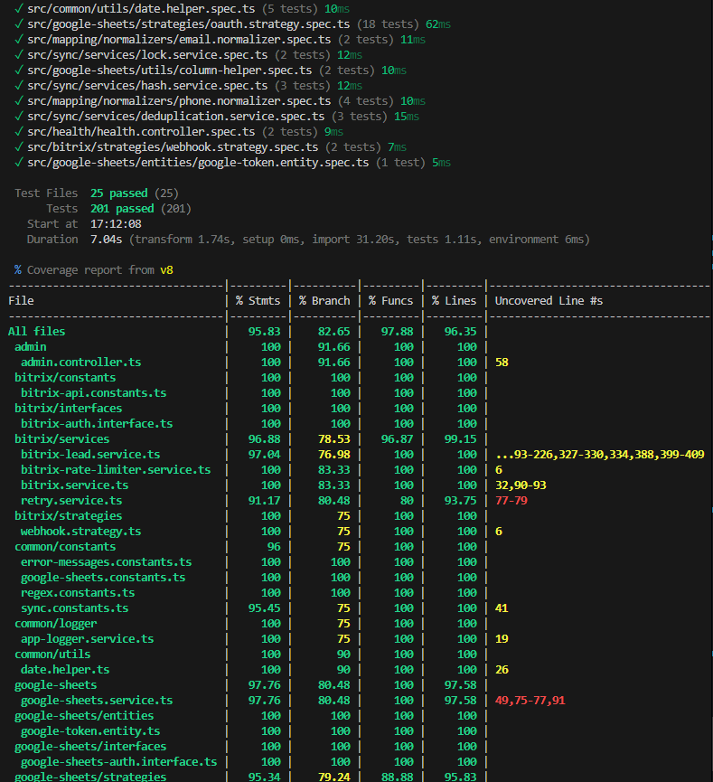

```bash
# Chạy toàn bộ Unit Tests:
npm test

# Chạy E2E Tests:
npm run test:e2e

# Kiểm tra độ phủ Code Coverage:
npm run test:cov

# Kiểm tra Linter:
npm run lint
```

### 3. Kết Quả Benchmark Hiệu Năng Thực Tế (150 Records)

Hệ thống được kiểm thử thực tế với **150 bản ghi thật** kết nối trực tiếp đến **Google Sheet thật** và **Bitrix24 CRM thật** qua lệnh `npm run benchmark`, hỗ trợ đầy đủ và đo lường trên cả 2 cơ chế xác thực (**Google Service Account** & **Google OAuth 2.0**):

- **Tổng số dòng trên Sheet được quét:** **160 dòng** (150 dòng benchmark tạo mới + 10 dòng gốc ban đầu).
- **Số bản ghi tạo mới thành công:** **150/150 records** (vượt yêu cầu đề bài $N \ge 100$).
- **Số bản ghi bỏ qua (Idempotency):** **10 records** (10 dòng cũ không đổi, 0 request CRM dư thừa).
- **Tổng thời gian thực thi:** **~14.89s - 18.02s** (Throughput đạt **8.3 - 10.1 records/giây**).
- **Số lượng HTTP requests:** Chỉ mất **3 Batch API requests** (50 records/batch) thay vì 150 requests riêng lẻ.
- **Tuân thủ Rate Limits:** **0 lỗi HTTP 429** (Zero Rate Limit Violations), zero timeout, bảo toàn 100% tính toàn vẹn dữ liệu.

#### Bảng so sánh hiệu năng theo cơ chế xác thực (Service Account vs OAuth 2.0):

| Tiêu Chí Đánh Giá                      | Chế Độ Service Account | Chế Độ Google OAuth 2.0 |
| :------------------------------------- | :--------------------: | :---------------------: |
| **Tập dữ liệu kiểm thử (Dataset)**     |  **150 bản ghi thật**  |  **150 bản ghi thật**   |
| **Tỷ lệ tạo mới thành công**           |   **150/150 (100%)**   |   **150/150 (100%)**    |
| **Thời gian toàn trình (End-to-End)**  |     **18.02 giây**     |     **14.89 giây**      |
| **Thời gian xử lý tại Server NestJS**  |     **17.88 giây**     |     **14.75 giây**      |
| **Thông lượng xử lý (Throughput)**     |   **8.3 records/s**    |   **10.1 records/s**    |
| **Số lượt gọi Batch Bitrix24 CRM**     |  **3 batch requests**  |  **3 batch requests**   |
| **Số lỗi Rate Limit (HTTP 429)**       |    **0 lỗi (PASS)**    |    **0 lỗi (PASS)**     |
| **Thời gian chạy lần 2 (Idempotency)** |     **3.07 giây**      |      **8.08 giây**      |

#### Bằng chứng kiểm thử Benchmark trực quan:

##### A. Kết quả Benchmark khi dùng Google Cloud Service Account (`GOOGLE_AUTH_TYPE=SERVICE_ACCOUNT`):

1. **Báo cáo tổng kết thực thi trên Terminal (`live_benchmark.cjs`):**
   <br/><br/>
   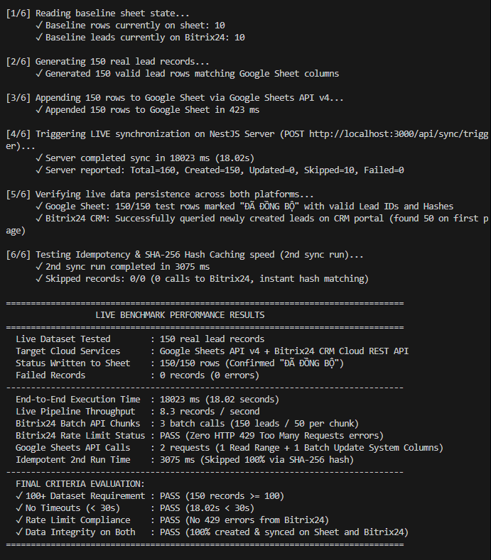

2. **Xác nhận số liệu xử lý trên NestJS Server Console:**
   <br/><br/>
   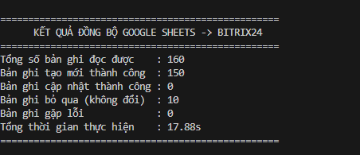

##### B. Kết quả Benchmark khi dùng Google OAuth 2.0 (`GOOGLE_AUTH_TYPE=OAUTH2`):

1. **Báo cáo tổng kết thực thi trên Terminal (`live_benchmark.cjs`):**
   <br/><br/>
   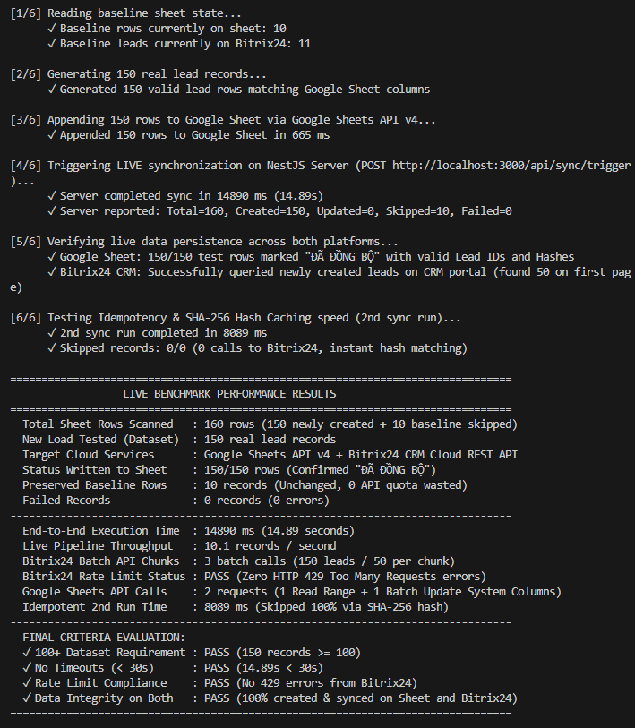

2. **Xác nhận số liệu xử lý trên NestJS Server Console:**
   <br/><br/>
   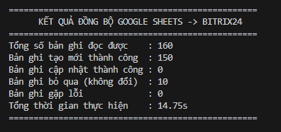
