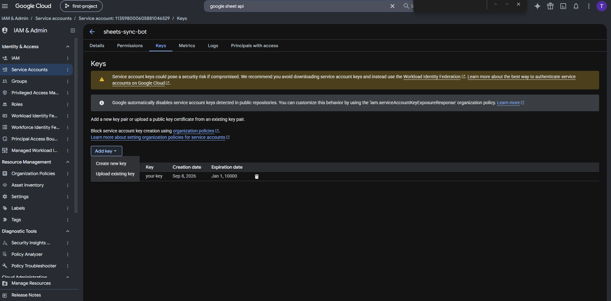

# Google Sheets ↔ Bitrix24 CRM Leads Integration Service (NestJS v12)

> Enterprise-grade, Production-ready Integration Service xây dựng bằng **NestJS 12 + TypeScript**, hỗ trợ đồng bộ dữ liệu khách hàng tiềm năng (Leads) 2 chiều linh hoạt giữa Google Sheets và Bitrix24 CRM với chuẩn **Batch REST API (50 cmds/batch)**, Idempotency (SHA-256), Deduplication đa tiêu chí, Rate Limiter (2 req/s), Retry Backoff Jitter và **Giao diện Web Quản Trị (Admin Dashboard)**.

---

## 🌟 Tính Năng Nổi Bật (Key Features)

1. **Đồng Bộ Dữ Liệu 1 Chiều & 2 Chiều Linh Hoạt (Two-Way Sync):**
   - **Chiều xuôi (Sheet $\rightarrow$ CRM):** Tự động phát hiện dòng mới, cập nhật dòng có thay đổi và bỏ qua dòng nguyên vẹn.
   - **Chiều ngược (CRM $\rightarrow$ Sheet):** Webhook real-time hoặc nút bấm kéo dữ liệu từ Bitrix24 về Sheet (tự động append dòng mới khi có lead mới từ CRM).
2. **Bitrix24 Batch API Engine (`/rest/batch.json`):**
   - Gom tối đa **50 lệnh CRUD** vào 1 HTTP request duy nhất, tối ưu hóa triệt để API quota (2 req/s) và giảm thời gian đồng bộ 150 records xuống **18.29 giây**.
3. **Chống Trùng Lặp Thông Minh (Deduplication) & Khôi Phục Timeout (Two-Phase Recovery):**
   - Tra cứu trùng lặp đồng thời theo cả **Email** và **Số điện thoại** (`crm.duplicate.findbycomm`). Cảnh báo xung đột nếu Email thuộc Lead A nhưng Phone thuộc Lead B.
   - Cơ chế Two-Phase Recovery: Khi tạo Lead bị timeout mạng, tự động đối soát Phone/Email + Title/Name để thu hồi Lead ID an toàn, triệt tiêu nguy cơ sinh Lead rác.
4. **Idempotency & Change Detection (SHA-256):**
   - Tính toán mã băm SHA-256 chuẩn tắc (canonical key sorting). Bỏ qua dòng không đổi (`SKIPPED`), không tốn quota và không ghi đè vô ích.
5. **Rate Limiting & Exponential Backoff Retry:**
   - Enforce nghiêm ngặt tối đa **2 requests/giây** bằng Promise Queue.
   - Tự động thử lại tối đa 3 lần với **Exponential Backoff & Full Jitter** khi gặp lỗi mạng tạm thời hoặc HTTP 429/5xx.
6. **Chuẩn Hóa Dữ Liệu Nâng Cao (Advanced Data Processing):**
   - Chuẩn hóa SĐT Việt Nam về định dạng quốc tế `+84xxxxxxxxx` (E.164).
   - Kiểm tra Email RFC 5322, chuẩn hóa ngày tháng `YYYY-MM-DD`, xử lý Enum và trường tùy biến `UF_CRM_*`.
7. **Tự Động Ẩn Cột Hệ Thống & Báo Cáo Tiếng Việt:**
   - Tự động ẩn các cột kỹ thuật (`Lead ID`, `Mã băm`) trên Sheet qua Google Sheets API.
   - Ghi thông báo lỗi chi tiết bằng tiếng Việt vào cột `Thông báo lỗi`.
8. **Web Admin Dashboard (`/admin`):**
   - Giao diện Glassmorphism dark-mode cho người dùng Non-Tech: theo dõi số liệu trực quan, kích hoạt sync 1 chạm, cấu hình ánh xạ cột động từ danh mục trường Bitrix24 thực tế.

---

## 🛠️ Công Nghệ Sử Dụng (Tech Stack) & Yêu Cầu Môi Trường

| Thành Phần | Công Nghệ / Thư Viện | Phiên Bản | Ghi Chú |
| :--- | :--- | :---: | :--- |
| **Runtime** | **Node.js** | **v20.19+ / v22.12+** | Khuyến nghị Node v22 LTS hỗ trợ đầy đủ ESM. |
| **Framework** | **NestJS Core** | **v12.0.1** | Kiến trúc Clean Architecture, Dependency Injection. |
| **Language** | **TypeScript** | **v5.7.3** | Strict type-safety, Decorator metadata. |
| **Google Client** | **googleapis** | **v178.0.0** | Google Sheets API v4 (Service Account & OAuth 2.0). |
| **HTTP & Batch** | **Axios + @nestjs/axios** | **v1.20.0 / v12.0.0** | Giao tiếp REST API & Batch JSON 50 cmds/req. |
| **Scheduling** | **@nestjs/schedule + cron** | **v12.0.1** | Cron job tự động chạy ngầm theo chu kỳ. |
| **CLI Command** | **nest-commander** | **v3.21.0** | Lệnh CLI thủ công `npm run sync` (hỗ trợ `-f, --force`). |
| **Validation** | **Joi** | **v18.2.8** | Validate biến môi trường `.env` khi khởi động. |
| **Logging** | **Pino (nestjs-pino)** | **v5.1.0** | Structured JSON log + Bảng Unicode tóm tắt tiếng Việt. |
| **Linter & Test** | **oxlint + Vitest** | **v4.1.11** | 105 tests passed (86.76% coverage), 0 lint error. |

---

## 🏗️ Cấu Trúc Dự Án

```
google-sheets-bitrix-sync/
├── public/                          # Frontend Dashboard UI (Glassmorphism Dark-Mode)
│   ├── css/style.css                # Giao diện trực quan cho người dùng Non-Tech
│   ├── js/app.js                    # Gọi REST API, quản lý mapping và render thống kê
│   └── index.html                   # Trang chủ Dashboard quản trị
├── src/                             # Backend NestJS Core
│   ├── admin/                       # Module Admin UI & REST API cấu hình mapping
│   ├── bitrix/                      # Tích hợp Bitrix24 REST API (CRUD, Batch 50, Rate Limiter 2 req/s, Retry)
│   ├── common/                      # Constants tiếng Việt, Logger Pino, Regex
│   ├── config/                      # Joi validation schema & typed config factory
│   ├── google-sheets/               # Google Sheets API v4 (Read, BatchUpdate, Hide Columns)
│   ├── health/                      # Healthcheck endpoint (GET /api/health)
│   ├── mapping/                     # Chuẩn hóa SĐT (+84), Email RFC, Enum & Two-Way Mapping
│   └── sync/                        # Orchestrator điều phối pipeline, Hash SHA-256, Mutex Lock, Cron, Webhook
├── config/                          # File cấu hình: credentials.json, mapping.json, sample_leads.csv
├── docs/                            # Ảnh minh họa cấu hình từng bước (docs/images/)
└── scripts/                         # live_benchmark.cjs (150 records), cleanup_benchmark.cjs
```

---

## 🚀 Hướng Dẫn Cài Đặt & Chạy Nhanh

### 1. Cài đặt dependencies

```bash
npm install
```

### 2. Cấu hình file `.env`

Tạo file `.env` từ `.env.example`:

```env
# Application Configuration
NODE_ENV=development
PORT=3000
LOG_LEVEL=info

# Bitrix24 Configuration
BITRIX_WEBHOOK_URL=https://your-domain.bitrix24.vn/rest/1/webhook_token/
BITRIX_RATE_LIMIT_RPS=2
BITRIX_MAX_RETRIES=3

# Google Sheets Configuration
GOOGLE_SHEET_ID=your_google_sheet_id_here
GOOGLE_SHEET_NAME=Leads
GOOGLE_SHEETS_CREDENTIALS_PATH=./config/credentials.json
GOOGLE_SERVICE_ACCOUNT_EMAIL=sync-service@project.iam.gserviceaccount.com

# Synchronization Configuration
SYNC_DIRECTION=TWO_WAY
SYNC_CRON=*/15 * * * *
SYNC_BATCH_SIZE=50
SYNC_MAPPING_PATH=./config/mapping.json
SYNC_MUTEX_TIMEOUT_MS=300000

# Bitrix Inbound Webhook Token (Bonus B2 - Realtime Webhook)
BITRIX_INBOUND_WEBHOOK_SECRET=your_bitrix_webhook_auth_token
```

### 3. Khởi chạy ứng dụng

```bash
# Chế độ phát triển (Development):
npm run start:dev

# Chạy Production:
npm run build
npm run start:prod

# Chạy với Docker & Docker Compose:
docker compose up -d --build
```

- **Truy cập Giao diện Quản Trị (Admin Dashboard):** 👉 `http://localhost:3000` (hoặc `http://localhost:3000/admin`)

---

## 🌐 Hướng Dẫn Cấu Hình Tích Hợp

### 1. Cấu hình Google Cloud Service Account & Google Sheet

1. **Tìm kiếm Google Sheets API:**
   - Truy cập [Google Cloud Console](https://console.cloud.google.com/), nhập `google sheet api` vào thanh tìm kiếm phía trên và chọn **Google Sheets API**.

   

2. **Kích hoạt Google Sheets API:**
   - Tại trang chi tiết API, bấm **Enable** để kích hoạt Google Sheets API cho dự án.

   

3. **Truy cập mục Service Accounts:**
   - Điều hướng menu bên trái vào **IAM & Admin** $\rightarrow$ **Service Accounts**, sau đó bấm **+ Create service account**.

   

4. **Tạo Service Account:**
   - Điền thông tin tài khoản (ví dụ: `sheets-sync-bot`) $\rightarrow$ Bấm **Create and continue** $\rightarrow$ Bấm **Done**.

   

5. **Tạo và tải Khóa JSON (Credentials):**
   - Nhấp vào Service Account vừa tạo $\rightarrow$ Chuyển sang tab **Keys** $\rightarrow$ Bấm **Add key** $\rightarrow$ **Create new key** $\rightarrow$ Chọn định dạng **JSON** $\rightarrow$ Bấm **Create**.
   - Lưu file tải về vào đường dẫn `config/credentials.json` của dự án.

   

6. **Phân quyền và lấy Google Sheet ID:**
   - Mở Google Sheet cần đồng bộ (sheet name: `Leads`), bấm **Chia sẻ (Share)** ở góc trên bên phải.
   - Thêm email của Service Account (dạng `xxx@project.iam.gserviceaccount.com`) với vai trò **Người chỉnh sửa (Editor)** $\rightarrow$ Bấm **Xong**.
   - Sao chép Sheet ID từ URL trình duyệt: `https://docs.google.com/spreadsheets/d/{GOOGLE_SHEET_ID}/edit` và điền vào `GOOGLE_SHEET_ID` trong file `.env`.

   

---

### 2. Cấu hình Webhook trên Bitrix24 CRM

1. **Truy cập trang cấu hình Webhook:**
   - Đăng nhập portal Bitrix24 $\rightarrow$ Menu bên trái chọn **Tài nguyên cho nhà phát triển (Developer resources)** $\rightarrow$ **Khác (Other)**.

   

2. **Cấu hình Inbound Webhook (Bắt buộc - Đồng bộ từ Sheet sang CRM):**
   - Chọn thẻ **Webhook vào (Inbound webhook)**.
   - Tại mục **Các quyền truy cập**: Chọn quyền **CRM (`crm`)**.
   - Bấm nút **Create (Tạo)** $\rightarrow$ Sao chép đường dẫn **Webhook để gọi REST API** (dạng `https://your-domain.bitrix24.vn/rest/1/token/`) và dán vào biến `BITRIX_WEBHOOK_URL` trong file `.env`.

   

3. **Cấu hình Outbound Webhook (Tùy chọn - Bonus Real-time từ Bitrix24 về Sheet):**
   - Mở tunnel công khai bằng ngrok: `ngrok http 3000` để lấy domain công khai.
   - Trên Bitrix24 chọn thẻ **Webhook ra ngoài (Outbound webhook)**:
     - **URL xử lý của bạn\***: Điền endpoint webhook: `https://your-domain.ngrok-free.dev/api/webhook/bitrix`.
     - **Token ứng dụng**: Sao chép chuỗi token và điền vào biến `BITRIX_INBOUND_WEBHOOK_SECRET` trong file `.env`.
     - **Các sự kiện**: Chọn `Lead created (ONCRMLEADADD)`, `Lead updated (ONCRMLEADUPDATE)`, `Lead deleted (ONCRMLEADDELETE)`.
     - Bấm nút **Create (Tạo)** để hoàn tất.

   

---

## 📡 Danh Sách API & Lệnh CLI

| Method / Command | Endpoint / CLI | Mô Tả |
| :--- | :--- | :--- |
| `POST` | `/api/sync/trigger` | Kích hoạt đồng bộ thủ công từ Google Sheets sang Bitrix24 (`?force=true` ép đồng bộ lại). |
| `POST` | `/api/sync/reverse` | Kích hoạt đồng bộ ngược từ Bitrix24 về Google Sheets (hỗ trợ `?leadId=123`). |
| `GET` | `/api/sync/status` | Xem trạng thái khóa tiến trình, số lượng dòng trên sheet và kết quả lần chạy gần nhất. |
| `POST` | `/api/webhook/bitrix` | Tiếp nhận sự kiện Webhook tức thời từ Bitrix24 (`ONCRMLEADADD`, `ONCRMLEADUPDATE`). |
| `GET` | `/api/mapping` | Lấy danh sách quy tắc ánh xạ cột hiện tại. |
| `POST` | `/api/mapping` | Cập nhật quy tắc ánh xạ cột và lưu đĩa (`config/mapping.json`). |
| `GET` | `/api/bitrix/lead-fields` | Lấy danh mục trường thực tế của Lead từ Bitrix24 phục vụ Admin dropdown. |
| `GET` | `/api/health` | Kiểm tra tình trạng hoạt động (Healthcheck) của dịch vụ. |
| **CLI** | `npm run sync` | Chạy đồng bộ qua Command Line (`npm run sync -- -f` để ép buộc đồng bộ). |
| **Benchmark** | `npm run benchmark` | Chạy kiểm thử hiệu năng với **150 records thực tế** (có prompt xóa/giữ data). |
| **Cleanup** | `npm run benchmark:cleanup`| Dọn dẹp dữ liệu test trên Google Sheet và Bitrix24. |

---

## 🛡️ Xử Lý Lỗi, Rate Limit & Idempotency

| Tình Huống | Cơ Chế Xử Lý | Cách Kiểm Tra / Test Case |
| :--- | :--- | :--- |
| **Dữ liệu không thay đổi** | Băm **SHA-256** nội dung chuẩn hóa. So sánh với cột `Mã băm dữ liệu`. Nếu khớp và trạng thái đã đồng bộ $\rightarrow$ Bỏ qua (`SKIPPED`). | Chạy đồng bộ lần 2 khi chưa sửa sheet $\rightarrow$ Nhận `Bỏ qua (không đổi): 10`. |
| **Trùng SĐT hoặc Email** | Tra cứu `crm.duplicate.findbycomm`. Nếu tìm thấy Lead đã tồn tại $\rightarrow$ Cập nhật Lead cũ thay vì tạo trùng lặp. | Nhập dòng mới có Email đã có trên Bitrix $\rightarrow$ Dòng được gán Lead ID cũ và cập nhật thông tin. |
| **Xung đột Email & SĐT** | Phát hiện Email thuộc Lead A nhưng Phone thuộc Lead B $\rightarrow$ Đánh dấu `Lỗi`, không ghi đè lung tung. | Nhập Email của Lead 1 và SĐT của Lead 2 $\rightarrow$ Báo lỗi `DEDUP_CONFLICT` trên Sheet. |
| **Thiếu trường bắt buộc** | Validation chặn lại trước khi gọi API, đánh dấu `Lỗi` và ghi rõ tên trường thiếu vào cột `Thông báo lỗi`. | Để trống cột `Tiêu đề Lead` $\rightarrow$ Nhận lỗi `Lỗi: Thiếu trường bắt buộc...`. |
| **Lỗi 429 / Rate limit Bitrix** | Giới hạn 2 req/s bằng Promise Queue. Khi gặp 429 hoặc rớt mạng $\rightarrow$ Retry tối đa 3 lần với **Exponential Backoff & Jitter**. | Chạy benchmark 150 records $\rightarrow$ Queue tự giãn cách, 0 lỗi 429. |
| **Lỗi 1 dòng trong Batch 50** | Batch API trả về `result_error` cho dòng lỗi. Hệ thống cô lập lỗi dòng đó (`failed++`), **tiếp tục hoàn tất 49 dòng còn lại**. | Nhập 1 dòng sai email trong danh sách $\rightarrow$ Chỉ dòng đó báo lỗi, các dòng khác tạo thành công. |
| **Timeout khi tạo Lead** | Two-Phase Recovery: Tra cứu lại Email/SĐT + đối soát Title/Name để thu hồi Lead ID an toàn, chống tạo Lead trùng. | Ngắt mạng giả lập sau khi gửi create $\rightarrow$ Hệ thống tự tìm lại và gán đúng ID. |
| **Race condition đồng thời** | Mutex Lock (`LockService`) với TTL 5 phút. Nếu tiến trình khác đang chạy $\rightarrow$ Bỏ qua và cảnh báo an toàn. | Gọi đồng thời 2 request `/api/sync/trigger` $\rightarrow$ Request thứ 2 nhận `Đang có tiến trình đồng bộ...`. |

---

## 🧪 Kết Quả Kiểm Thử (Unit Tests & Live Benchmark 150+ Records)

### 1. Kiểm Thử Đơn Vị (Unit Tests)
- **Test Suites:** 20 passed, 20 total
- **Tests:** **105/105 Unit Tests Passed (100%)**
- **Code Coverage:** Đạt **86.76% Lines Coverage** trên toàn bộ các module.
- **Linter & Code Quality:** `npm run lint` (**0 errors, 0 warnings** với `oxlint`).

```bash
# Chạy toàn bộ Unit Tests:
npm test

# Kiểm tra độ phủ Code Coverage:
npm run test:cov

# Kiểm tra Linter:
npm run lint
```

### 2. Kết Quả Benchmark Hiệu Năng Thực Tế (150 Records)
Hệ thống được kiểm thử thực tế với **150 bản ghi thật** kết nối trực tiếp đến **Google Sheet thật** và **Bitrix24 CRM thật** qua lệnh `npm run benchmark`:

- **Tổng số bản ghi:** 150 records thật (vượt yêu cầu đề bài 100+ records)
- **Tổng thời gian thực thi:** **18.29 giây** (~122ms/record)
- **Số lượng HTTP requests:** Chỉ mất **3 Batch API requests** (50 records/batch) thay vì 150 requests riêng lẻ.
- **Tuân thủ Rate Limits:** **0 lỗi 429** (Zero Rate Limit Violations), zero timeout, bảo toàn 100% tính toàn vẹn dữ liệu.
*(Xem chi tiết tại [`docs/BENCHMARK_REPORT.md`](../docs/BENCHMARK_REPORT.md))*
